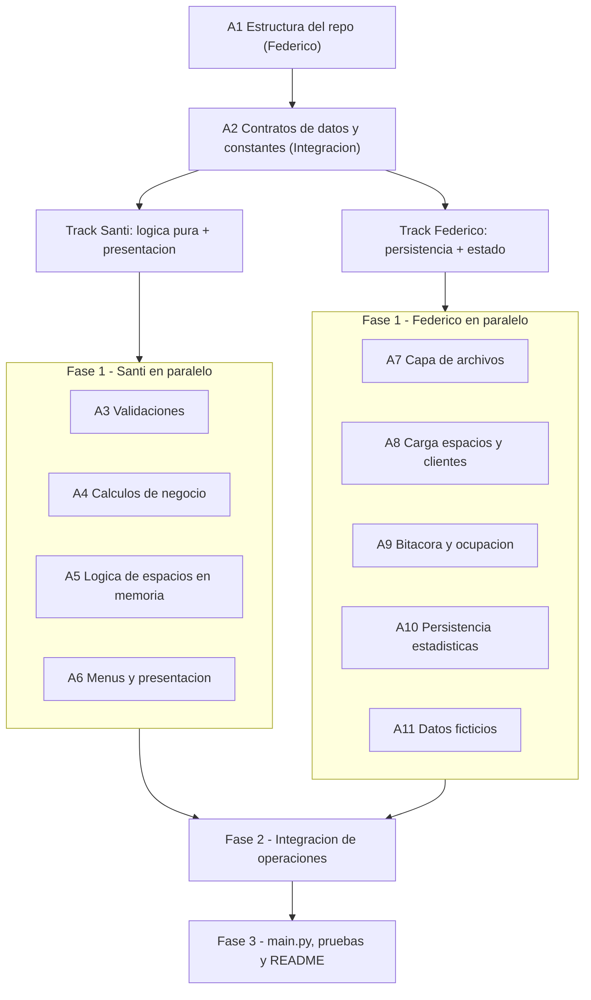

# Plan de desarrollo: Sistema de gestión de estacionamiento (Python)

Sistema de consola con persistencia real en archivos (`data/`), modularizado en `src/`. El plan organiza el desarrollo en 4 fases, repartiendo el trabajo entre **Federico** y **Santi**, maximizando el trabajo en paralelo. La clave para poder trabajar en paralelo es acordar primero los **contratos de datos** (estructuras en memoria y constantes); una vez fijados, Santi construye toda la lógica pura y de presentación recibiendo estructuras por parámetro, mientras Federico construye la capa de archivos y el estado del sistema. Ambos convergen en la Fase 2 (integración de operaciones).

Estructura objetivo del proyecto (según especificación, sección 9):

- `main.py`
- `src/archivos.py`, `src/espacios.py`, `src/movimientos.py`, `src/clientes.py`, `src/estadisticas.py`, `src/menus.py`, `src/validaciones.py`, `src/calculos.py`
- `data/espacios.csv`, `data/movimientos.csv`, `data/clientes.json`, `data/estadisticas.json`

## Mapa de dependencias y flujo

- **Individuales concurrentes (sin dependencia cruzada):** A3, A4, A5, A6 (Santi) y A7, A8, A9, A10, A11 (Federico).
- **De integración (requieren ambos tracks):** A2, A12, A13, A14, A17, A19.

---

## Fase 0 - Base comun

### A1. Inicializacion del repositorio y estructura de carpetas
- **Responsable:** Federico | **Tipo:** Individual | **Depende de:** nada
- **Descripcion:** Crear el esqueleto del proyecto: carpeta `src/` con los archivos de modulos vacios, carpeta `data/`, `main.py` inicial y `.gitignore`. Dejar cada modulo con su encabezado y las firmas (nombres) de funciones acordadas, aunque devuelvan valores provisorios, para que ambos puedan importar sin errores.
- **A implementar/modificar:** archivos `main.py`, `src/archivos.py`, `src/espacios.py`, `src/movimientos.py`, `src/clientes.py`, `src/estadisticas.py`, `src/menus.py`, `src/validaciones.py`, `src/calculos.py`; carpeta `data/`; `.gitignore`.

### A2. Definicion de contratos de datos y constantes
- **Responsable:** Integracion (acuerdan ambos; Federico consolida en codigo) | **Tipo:** Integracion | **Depende de:** A1
- **Descripcion:** Fijar y documentar en un modulo comun las estructuras en memoria y las constantes globales que usaran ambos. Esto es lo que permite trabajar en paralelo sin pisarse. Se acuerda: forma de `espacios` (lista de diccionarios con `codigo`, `piso`, `numero`), `clientes` (diccionario indexado por DNI con `nombre` y `total_horas`), `ocupacion` (diccionario por codigo de espacio con `dni` y `fecha_hora_ingreso`), y los campos de un movimiento (`fecha_hora`, `codigo_espacio`, `dni`, `accion`). Tambien se definen constantes: tarifa por hora, umbral y porcentaje de descuento, formato de fecha/hora, rutas de los archivos y nombres de los dias de la semana.
- **A implementar/modificar:** constantes globales (tarifa por hora, umbral de horas para descuento, porcentaje de descuento, formato de fecha, rutas de archivos, mapa de dias de semana); documentar (comentarios) la forma esperada de `espacios`, `clientes`, `ocupacion` y de una fila de movimiento.

---

## Fase 1 - Desarrollo en paralelo

### Track Santi (logica pura y presentacion, recibe estructuras por parametro)

### A3. Modulo de validaciones
- **Responsable:** Santi | **Tipo:** Individual (concurrente) | **Depende de:** A2
- **Descripcion:** Implementar todas las validaciones de entrada del usuario como funciones puras que reciben un texto o valor y devuelven si es valido (y/o el valor convertido). Debe validar: opciones de menu (numero dentro de un rango), DNI (solo digitos, longitud entre 7 y 8), nombre (no vacio) y formato de codigo de espacio (patron tipo piso + numero de espacio). Cada validacion define el mensaje de error claro asociado.
- **A implementar/modificar:** en `src/validaciones.py`: `validar_opcion_menu`, `validar_dni`, `validar_nombre`, `validar_codigo_espacio`. Estructuras: uso de condicionales y de metodos de cadenas; sin acceso a archivos.

### A4. Modulo de calculos de negocio
- **Responsable:** Santi | **Tipo:** Individual (concurrente) | **Depende de:** A2
- **Descripcion:** Implementar los calculos numericos del sistema como funciones puras. Calcular la permanencia en horas a partir de dos fechas/hora, cobrando por hora o fraccion (redondeo hacia arriba usando minutos totales). Calcular el importe multiplicando horas a cobrar por la tarifa. Determinar el estado del descuento de un cliente segun sus horas acumuladas y aplicar el 10% de descuento cuando corresponde. Estas funciones no leen ni escriben archivos; reciben los datos ya obtenidos.
- **A implementar/modificar:** en `src/calculos.py`: `calcular_permanencia_horas` (diferencia de fechas -> minutos -> horas por fraccion), `calcular_importe`, `estado_descuento` (segun umbral de horas), `aplicar_descuento`. Estructuras: aritmetica de fechas/tiempos y condicionales.

### A5. Logica de espacios en memoria
- **Responsable:** Santi | **Tipo:** Individual (concurrente) | **Depende de:** A2
- **Descripcion:** Implementar las operaciones sobre la lista de espacios que no tocan archivos, recibiendo `espacios` y `ocupacion` como parametros. Buscar un espacio por su codigo, listar los espacios disponibles agrupados por piso, y sugerir el espacio disponible mas cercano (menor piso y, dentro del piso, menor numero). Estas funciones seran usadas luego por la consulta de espacios y por el registro de ingreso.
- **A implementar/modificar:** en `src/espacios.py`: `buscar_espacio`, `listar_disponibles` (agrupacion por piso, ej. diccionario piso -> lista de codigos), `sugerir_espacio`. Estructuras: ciclos y comparaciones sobre la lista de espacios y el diccionario de ocupacion.

### A6. Menus y presentacion
- **Responsable:** Santi | **Tipo:** Individual (concurrente) | **Depende de:** A2
- **Descripcion:** Implementar la presentacion por consola: mostrar el menu principal numerado (7 opciones), el menu anidado de estadisticas (4 opciones), la lectura de la opcion elegida con reintento ante entradas invalidas, el formato de listado de espacios disponibles (por piso mas la linea de libres/ocupados/total) y la pausa "Presione Enter para volver al menu". No coordina la logica todavia; solo muestra e ingresa datos.
- **A implementar/modificar:** en `src/menus.py`: `mostrar_menu_principal`, `mostrar_menu_estadisticas`, `leer_opcion`, `formatear_espacios_disponibles`, `pausar_para_continuar`. Estructuras: ciclos de reintento y uso de las validaciones de A3.

### Track Federico (persistencia y estado del sistema)

### A7. Capa de acceso a archivos
- **Responsable:** Federico | **Tipo:** Individual (concurrente) | **Depende de:** A2
- **Descripcion:** Implementar el modulo generico de entrada/salida: leer un CSV a lista de diccionarios, agregar una linea al final de un CSV (escritura por agregado), leer un JSON a diccionario y guardar un diccionario como JSON. Incluir la creacion de archivos faltantes con estructura inicial valida (clientes vacio, estadisticas vacia, movimientos con encabezado), excepto `espacios.csv` que debe existir. Manejar archivos inexistentes o danados con mensajes de error comprensibles.
- **A implementar/modificar:** en `src/archivos.py`: `leer_csv`, `agregar_linea_csv`, `leer_json`, `guardar_json`, `asegurar_archivos_iniciales`. Estructuras: manejo basico de errores en apertura/lectura y creacion condicional de archivos.

### A8. Carga de espacios y clientes
- **Responsable:** Federico | **Tipo:** Individual (concurrente) | **Depende de:** A7
- **Descripcion:** Implementar la carga inicial de la configuracion estatica de espacios desde el CSV a la lista en memoria (validando que codigo sea unico y que piso/numero sean numericos, informando si el archivo esta vacio o invalido) y la carga/guardado del diccionario de clientes desde/hacia el JSON. Incluir tambien registrar un cliente nuevo y actualizar sus horas acumuladas persistiendo el cambio.
- **A implementar/modificar:** en `src/espacios.py`: `cargar_espacios`. En `src/clientes.py`: `cargar_clientes`, `guardar_clientes`, `buscar_cliente`, `registrar_cliente`, `actualizar_horas`. Estructuras: lista de diccionarios (espacios), diccionario por DNI (clientes).

### A9. Bitacora de movimientos y reconstruccion de ocupacion
- **Responsable:** Federico | **Tipo:** Individual (concurrente) | **Depende de:** A7
- **Descripcion:** Implementar el nucleo del estado: agregar un movimiento (INGRESO/EGRESO) al CSV de la bitacora, reconstruir la ocupacion actual recorriendo la lista completa de espacios y todos los movimientos (el ultimo movimiento por espacio determina si esta ocupado o libre), y obtener el ingreso activo de un espacio ocupado. Aqui se garantizan las reglas: no ingresar en espacio ocupado y no egresar de espacio libre.
- **A implementar/modificar:** en `src/movimientos.py`: `registrar_movimiento`, `reconstruir_ocupacion` (devuelve el diccionario `ocupacion`), `obtener_ingreso_activo`. Estructuras: ciclos sobre la bitacora, diccionario de ocupacion por codigo de espacio.

### A10. Persistencia y actualizacion de estadisticas
- **Responsable:** Federico | **Tipo:** Individual (concurrente) | **Depende de:** A7
- **Descripcion:** Implementar la carga y guardado del JSON de estadisticas agregadas y su actualizacion. Al registrar un ingreso se incrementan los ingresos del dia; al registrar un egreso se incrementan egresos y se suman horas en `por_fecha`, `por_mes` y `por_dia_semana`. Proveer tambien el acceso a los datos crudos que luego usaran los calculos de porcentaje y promedios.
- **A implementar/modificar:** en `src/estadisticas.py`: `cargar_estadisticas`, `guardar_estadisticas`, `actualizar_por_ingreso`, `actualizar_por_egreso`. Estructuras: diccionario anidado (`por_fecha`, `por_mes`, `por_dia_semana`).

### A11. Datos ficticios iniciales
- **Responsable:** Federico | **Tipo:** Individual (concurrente) | **Depende de:** A7
- **Descripcion:** Poblar los archivos de `data/` con datos iniciales ficticios pero coherentes para permitir una demostracion completa: un `espacios.csv` con varios pisos y espacios, algunos clientes en `clientes.json` (con horas acumuladas variadas, incluyendo alguno con descuento disponible), un `movimientos.csv` con algunos ingresos activos (espacios ocupados) y estadisticas historicas por mes y dia de la semana en `estadisticas.json`.
- **A implementar/modificar:** contenido de `data/espacios.csv`, `data/clientes.json`, `data/movimientos.csv`, `data/estadisticas.json` conforme a los formatos de la seccion 6 de la especificacion.

---

## Fase 2 - Integracion de operaciones

### A12. Operacion Registrar ingreso
- **Responsable:** Federico | **Tipo:** Integracion | **Depende de:** A3, A5, A8, A9, A10
- **Descripcion:** Ensamblar el flujo completo de ingreso: pedir y validar el DNI, buscar el cliente y ofrecer registrarlo si no existe (permitiendo continuar como no registrado), verificar espacios disponibles, sugerir el espacio mas cercano o permitir eleccion manual validada, registrar el movimiento de ingreso en la bitacora, actualizar la ocupacion en memoria y las estadisticas del dia, y mostrar el mensaje de exito con el espacio asignado.
- **A implementar/modificar:** funcion `registrar_ingreso` (coordinacion entre validaciones, espacios, clientes, movimientos y estadisticas); actualizacion del diccionario `ocupacion` en memoria.

### A13. Operacion Registrar egreso
- **Responsable:** Federico | **Tipo:** Integracion | **Depende de:** A3, A4, A8, A9, A10
- **Descripcion:** Ensamblar el flujo de egreso: pedir y validar el codigo de espacio, verificar que este ocupado, obtener el ingreso activo, calcular permanencia e importe, aplicar descuento si el cliente registrado ya supera el umbral de horas, actualizar las horas acumuladas del cliente, registrar el movimiento de egreso, actualizar ocupacion y estadisticas, e informar si el cliente alcanzo el descuento para su proxima visita. Mostrar el resumen completo (codigo, DNI, ingreso, egreso, permanencia, importe e info de cliente).
- **A implementar/modificar:** funcion `registrar_egreso` (coordina calculos, clientes, movimientos, estadisticas); liberacion del espacio en `ocupacion`.

### A14. Registrar cliente y Consultar cliente
- **Responsable:** Registrar cliente: Federico | Consultar cliente: Santi | **Tipo:** Integracion | **Depende de:** A3, A8; Consultar depende ademas de A4 y A6
- **Descripcion:** Registrar cliente: validar DNI, verificar si ya existe, solicitar y validar el nombre, crear el cliente con horas en cero y persistirlo, con mensaje de exito. Consultar cliente: validar DNI, buscar el cliente en memoria, mostrar sus datos y el estado del beneficio de descuento; si no existe, informar y ofrecer iniciar el flujo de registro.
- **A implementar/modificar:** funcion `flujo_registrar_cliente` (usa `registrar_cliente` de A8); funcion `flujo_consultar_cliente` (usa `buscar_cliente` y `estado_descuento`, encadena con el registro si el usuario acepta).

### A15. Consultar espacios disponibles
- **Responsable:** Santi | **Tipo:** Integracion liviana | **Depende de:** A5, A6, A9
- **Descripcion:** Implementar la consulta que toma la ocupacion actual (ya reconstruida en memoria) y muestra los espacios disponibles agrupados por piso, mas los totales de libres, ocupados y total, usando el formateo de A6 y la logica de A5. No escribe archivos.
- **A implementar/modificar:** funcion `flujo_consultar_espacios` (usa `listar_disponibles` y `formatear_espacios_disponibles`).

### A16. Consultar estadisticas
- **Responsable:** Santi | **Tipo:** Integracion liviana | **Depende de:** A4, A6, A10
- **Descripcion:** Implementar el submenu de estadisticas y sus opciones sobre el diccionario de estadisticas en memoria: porcentaje de ocupacion actual (ocupados sobre totales), cantidad de vehiculos atendidos hoy (ingresos del dia) y tiempo promedio de permanencia por mes o por dia de la semana, mostrando "Sin datos suficientes" cuando la cantidad de egresos sea cero.
- **A implementar/modificar:** funciones `calcular_porcentaje_ocupacion` y `calcular_promedio` en `src/estadisticas.py` (funciones puras que reciben los datos); funcion `flujo_consultar_estadisticas` en el modulo de menus/operaciones.

---

## Fase 3 - Ensamblado final, pruebas y documentacion

### A17. Programa principal e integracion del flujo
- **Responsable:** Federico | **Tipo:** Integracion | **Depende de:** A12, A13, A14, A15, A16
- **Descripcion:** Implementar `main.py`: asegurar los archivos iniciales, cargar espacios, clientes, movimientos, reconstruir ocupacion y cargar estadisticas; luego mostrar el menu principal en bucle y despachar cada opcion a su operacion, volviendo al menu tras cada una. Coordinar el paso del estado en memoria (espacios, clientes, ocupacion, estadisticas) entre operaciones.
- **A implementar/modificar:** `main.py` (secuencia de inicio de la seccion 4.1 y bucle del menu principal); funcion despachadora de opciones.

### A18. Finalizacion del programa
- **Responsable:** Santi | **Tipo:** Individual | **Depende de:** A6
- **Descripcion:** Implementar la opcion de finalizar: mostrar el mensaje de cierre y una breve pausa antes de terminar la ejecucion.
- **A implementar/modificar:** funcion `finalizar_programa` (mensaje de cierre y pausa breve).

### A19. Pruebas de los casos minimos
- **Responsable:** Integracion (ambos) | **Tipo:** Integracion | **Depende de:** A17, A18
- **Descripcion:** Ejecutar y verificar manualmente los casos minimos de la seccion 11: ingreso valido, egreso valido con calculo de permanencia e importe, casos de validacion (DNI con letras, egreso de espacio libre) y consultas de estadisticas antes/despues de operaciones. Ajustar mensajes y detalles detectados.
- **A implementar/modificar:** correcciones puntuales en los modulos segun hallazgos; no requiere nuevos modulos.

### A20. README y registro de uso de IA
- **Responsable:** Santi redacta, Federico revisa | **Tipo:** Integracion | **Depende de:** A17
- **Descripcion:** Completar el `README.md` con: integrantes y comision, descripcion general del sistema, instrucciones de ejecucion y el registro de que herramientas de IA se usaron, para que y como (requerido por la consigna).
- **A implementar/modificar:** `README.md`.

## Notas de organizacion

- Se recomienda que Santi trabaje siempre contra las estructuras acordadas en A2, probando sus funciones con datos de ejemplo en memoria; asi avanza sin esperar la capa de archivos.
- Commits periodicos por actividad para evidenciar el proceso (requisito de la consigna).
- La integracion real de cada operacion (Fase 2) se hace cuando ambos tracks de la Fase 1 estan disponibles.