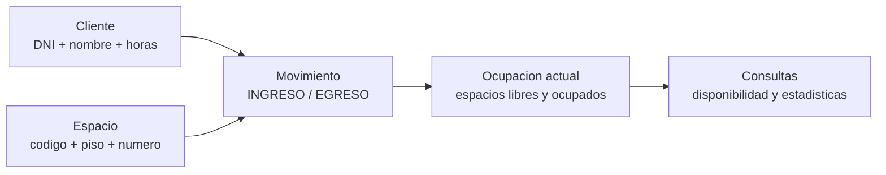
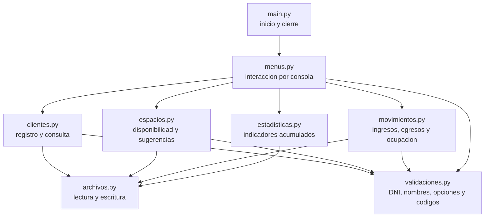
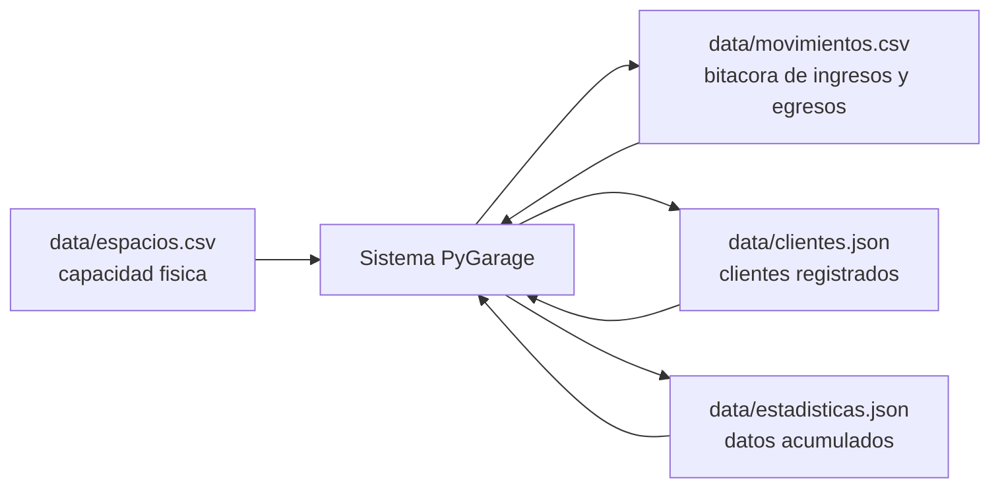
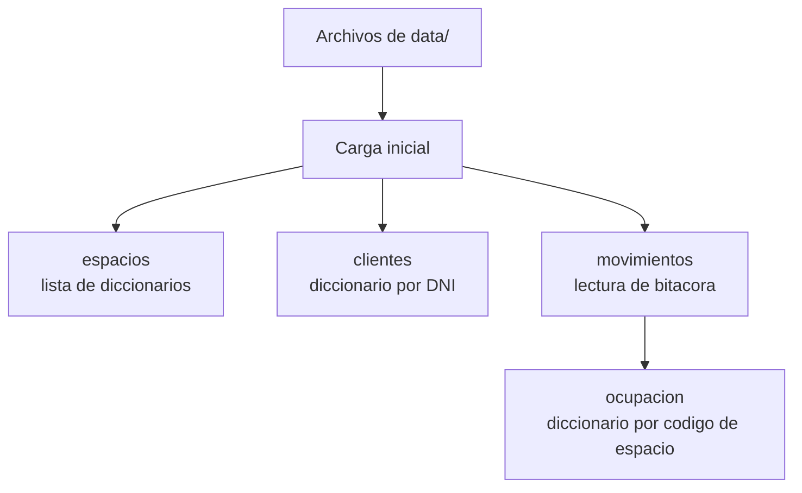
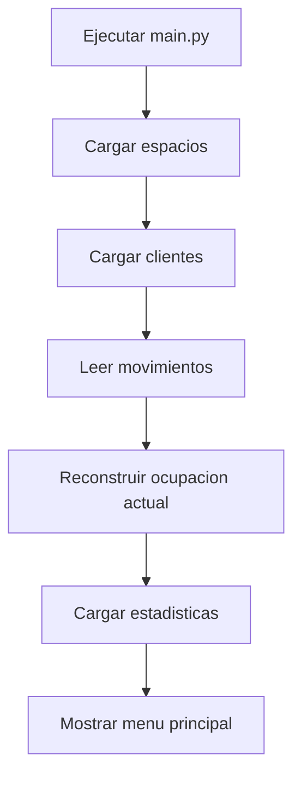
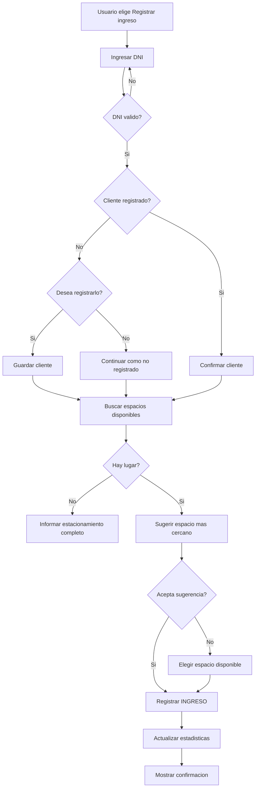
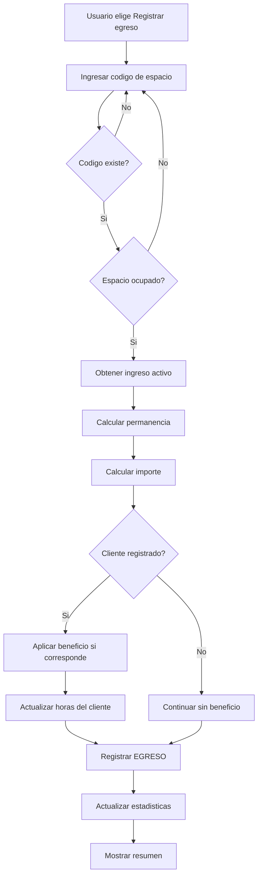
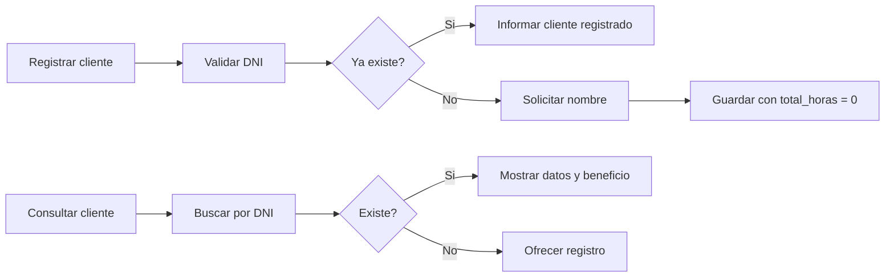
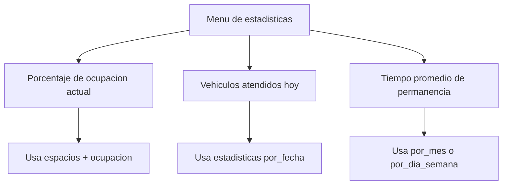

# PyGarage

Sistema de gestión de estacionamiento por consola, desarrollado como Trabajo Final Integrador de Laboratorio de Python. El proyecto apunta a resolver operaciones básicas de negocio: registrar ingresos y egresos de vehículos, controlar disponibilidad de espacios, gestionar clientes y consultar estadísticas simples.

> Documentación base:
> - [Consigna del trabajo](docs/consigna.md)
> - [Especificación final del sistema](docs/especificaciones.md)

## Datos Del Proyecto

- **Materia:** Algoritmos y Estructuras de Datos - Laboratorio de Python
- **Carrera:** Ingeniería en Sistemas de Información
- **Año:** 2026
- **Comisión:** 2.1
- **Integrantes:**
  - LARREA, Santiago Hernán
  - BEJARANO, Federico

Según la [consigna](docs/consigna.md#requisitos-técnicos), el sistema debe desarrollarse en Python, ejecutarse por consola y demostrar modularización, validaciones, estructuras de control, acumuladores, contadores y manejo básico de errores.

## 1. Visión General Del Sistema

PyGarage administra el funcionamiento diario de un estacionamiento. Desde el punto de vista del negocio, el sistema responde tres preguntas principales:

- ¿Qué espacios están libres u ocupados?
- ¿Qué cliente o vehículo ingresó y cuándo debe egresar?
- ¿Qué información histórica simple permite entender el uso del estacionamiento?

El alcance funcional está definido en [Funciones incluidas](docs/especificaciones.md#21-funciones-incluidas) y [Funciones no incluidas](docs/especificaciones.md#22-funciones-no-incluidas). No se incluyen interfaz gráfica, base de datos, reservas anticipadas, usuarios con contraseña ni integración con medios de pago.

### 1.1 Conceptos De Negocio

El sistema se apoya en cuatro conceptos principales, definidos en [Conceptos principales](docs/especificaciones.md#3-conceptos-principales):

- **Cliente:** persona que utiliza el estacionamiento. Puede estar registrada o no. Si está registrada, acumula horas para beneficios.
- **Espacio:** lugar físico donde se estaciona un vehículo. Tiene código, piso y número.
- **Movimiento:** evento histórico de ingreso o egreso asociado a un espacio, un DNI y una fecha/hora.
- **Ocupación actual:** estado calculado a partir de los espacios existentes y la bitácora de movimientos.



En términos simples: los espacios definen la capacidad del estacionamiento, los movimientos cuentan lo que ocurrió, los clientes permiten acumular beneficios y la ocupación actual se reconstruye mirando el último movimiento de cada espacio.

### 1.2 Módulos Del Sistema

La organización sugerida del código se describe en [Organización sugerida del código](docs/especificaciones.md#9-organización-sugerida-del-código) y [Responsabilidades sugeridas por módulo](docs/especificaciones.md#10-responsabilidades-sugeridas-por-módulo).



A nivel de negocio, `menus.py` funciona como el mostrador de atención: recibe lo que la persona usuaria quiere hacer. Los módulos de dominio (`clientes.py`, `espacios.py`, `movimientos.py` y `estadisticas.py`) resuelven cada operación. `archivos.py` se encarga de guardar y recuperar datos, mientras que `validaciones.py` evita que entren datos inválidos.

### 1.3 Decisiones De Diseño

Las decisiones finales están resumidas en [Decisiones finales de diseño](docs/especificaciones.md#13-decisiones-finales-de-diseño):

- El **DNI** identifica al cliente.
- El **código de espacio** identifica la ocupación física.
- El historial se guarda como bitácora en `movimientos.csv`.
- La ocupación actual no se guarda duplicada: se reconstruye desde los movimientos.
- Las estadísticas históricas se guardan agregadas en `estadisticas.json`.
- La complejidad se mantiene adecuada a un nivel inicial de Python.

## 2. Estructura De Archivos Y Datos

La persistencia se describe en [Persistencia de datos](docs/especificaciones.md#6-persistencia-de-datos). El sistema utiliza archivos reales dentro del proyecto, sin base de datos.

### 2.1 Estructura General

```text
tp-python/
├── README.md
├── docs/
│   ├── consigna.md
│   └── especificaciones.md
├── main.py
├── src/
│   ├── archivos.py
│   ├── clientes.py
│   ├── espacios.py
│   ├── movimientos.py
│   ├── estadisticas.py
│   ├── menus.py
│   └── validaciones.py
└── data/
    ├── espacios.csv
    ├── movimientos.csv
    ├── clientes.json
    └── estadisticas.json
```

Esta estructura separa el código fuente, la documentación y los datos persistidos. Si el proyecto se implementa con menos archivos, la regla principal se mantiene: cada función debe tener una responsabilidad clara, como indica [Criterios de implementación](docs/especificaciones.md#12-criterios-de-implementación).

### 2.2 Archivos De Persistencia



`espacios.csv` define la capacidad del estacionamiento y se considera una configuración estática. `movimientos.csv` funciona como historial de eventos. `clientes.json` guarda clientes registrados y horas acumuladas. `estadisticas.json` guarda totales históricos para calcular indicadores sin generar miles de movimientos ficticios.

### 2.3 Registros Principales

Los formatos están definidos en [Archivo de espacios](docs/especificaciones.md#62-archivo-de-espacios), [Archivo de movimientos](docs/especificaciones.md#63-archivo-de-movimientos), [Archivo de clientes](docs/especificaciones.md#64-archivo-de-clientes) y [Archivo de estadísticas](docs/especificaciones.md#65-archivo-de-estadísticas).

#### Espacio

```csv
codigo,piso,numero
P1-E01,1,1
P1-E02,1,2
P2-E01,2,1
```

Cada espacio tiene un código único. El ejemplo `P1-E01` significa piso 1, espacio 1.

#### Movimiento

```csv
fecha_hora,codigo_espacio,dni,accion
2026-07-08 09:15:00,P1-E01,12345678,INGRESO
2026-07-08 11:40:00,P1-E01,12345678,EGRESO
```

Cada línea representa un evento. No se borran movimientos anteriores, porque el archivo sirve como bitácora histórica.

#### Cliente

```json
{
  "12345678": {
    "nombre": "Juan Perez",
    "total_horas": 15
  }
}
```

La clave principal es el DNI como texto. `total_horas` permite calcular el estado del beneficio por fidelización.

#### Estadísticas

```json
{
  "por_fecha": {
    "2026-07-08": {
      "ingresos": 12,
      "egresos": 10,
      "total_horas": 36
    }
  },
  "por_mes": {
    "2026-07": {
      "egresos": 10,
      "total_horas": 36
    }
  }
}
```

Este archivo guarda datos agregados para responder consultas como cantidad de vehículos atendidos y tiempo promedio de permanencia. La forma de actualización está detallada en [Actualización de estadísticas](docs/especificaciones.md#actualización-de-estadísticas).

### 2.4 Estructuras En Memoria

Durante la ejecución, los archivos se cargan en listas y diccionarios simples, como se explica en [Datos en memoria](docs/especificaciones.md#7-datos-en-memoria).



Ejemplo conceptual:

```python
espacios = [
    {"codigo": "P1-E01", "piso": 1, "numero": 1}
]

clientes = {
    "12345678": {"nombre": "Juan Perez", "total_horas": 15}
}

ocupacion = {
    "P1-E01": {
        "dni": "12345678",
        "fecha_hora_ingreso": "2026-07-08 09:15:00"
    }
}
```

Si un código de espacio no aparece en `ocupacion`, el sistema lo considera disponible.

## 3. Flujo De Usuario E Implementación

El flujo general está documentado en [Flujo general del programa](docs/especificaciones.md#4-flujo-general-del-programa), y cada operación está detallada en [Flujo de usuario por operación](docs/especificaciones.md#5-flujo-de-usuario-por-operación).

### 3.1 Inicio Del Sistema



Al iniciar, el sistema prepara los datos necesarios para operar. Si faltan archivos de clientes, movimientos o estadísticas, pueden crearse con una estructura inicial válida. El archivo de espacios debe existir porque define la capacidad del estacionamiento.

### 3.2 Menú Principal

El menú principal se basa en [Menú principal](docs/especificaciones.md#42-menú-principal):

```text
1. Registrar ingreso
2. Registrar egreso
3. Registrar cliente
4. Consultar cliente
5. Consultar espacios disponibles
6. Consultar estadísticas
7. Finalizar programa
```

Después de cada operación, el sistema vuelve al menú. Esta decisión está explicada en [Continuidad después de cada operación](docs/especificaciones.md#43-continuidad-después-de-cada-operación).

### 3.3 Registrar Ingreso

El ingreso está definido en [Registrar ingreso](docs/especificaciones.md#51-registrar-ingreso).



A nivel de implementación, el sistema valida el DNI, busca o registra el cliente, calcula los espacios libres desde `ocupacion`, sugiere el espacio con menor piso y menor número, agrega un movimiento `INGRESO` y actualiza estadísticas del día.

### 3.4 Registrar Egreso

El egreso está definido en [Registrar egreso](docs/especificaciones.md#52-registrar-egreso).



La permanencia se calcula por hora o fracción, como indica [Cálculo de permanencia](docs/especificaciones.md#cálculo-de-permanencia). El importe se obtiene con una tarifa fija por hora, según [Cálculo de importe](docs/especificaciones.md#cálculo-de-importe). Los clientes registrados pueden acceder a descuento por horas acumuladas, explicado en [Descuento para clientes registrados](docs/especificaciones.md#descuento-para-clientes-registrados).

### 3.5 Registrar Y Consultar Clientes

Los flujos están definidos en [Registrar cliente](docs/especificaciones.md#53-registrar-cliente) y [Consultar cliente](docs/especificaciones.md#54-consultar-cliente).



El objetivo de registrar clientes no es controlar el acceso, sino permitir acumulación de horas y beneficios informativos.

### 3.6 Consultas Y Estadísticas

La consulta de espacios está definida en [Consultar espacios disponibles](docs/especificaciones.md#55-consultar-espacios-disponibles), y las estadísticas en [Consultar estadísticas](docs/especificaciones.md#56-consultar-estadísticas).



Estas consultas no modifican la ocupación. Solo leen datos en memoria o datos agregados para mostrar información clara al usuario.

### 3.7 Validaciones Y Errores

Las validaciones se describen en [Validaciones](docs/especificaciones.md#8-validaciones). El sistema debe controlar opciones de menú, DNI, nombres, códigos de espacio, disponibilidad y formato mínimo de archivos.

Ejemplos de mensajes esperados:

```text
Opcion invalida. Ingrese un numero del menu.
DNI invalido. Debe ingresar solo numeros.
El espacio ingresado no existe.
El espacio seleccionado ya esta ocupado.
No hay espacios disponibles en este momento.
```

Para cancelar una carga, se puede usar `0` y volver al menú, como propone [Reintentos y salida](docs/especificaciones.md#83-reintentos-y-salida).

## 4. Ejecución

El proyecto debe ejecutarse por consola, de acuerdo con [Requisitos técnicos](docs/consigna.md#requisitos-técnicos).

Cuando el código esté implementado, la ejecución esperada será:

```bash
python main.py
```

Si se utiliza una carpeta `src/`, `main.py` será el punto de entrada encargado de inicializar datos y abrir el menú principal.

## 5. Casos De Prueba Sugeridos

La especificación propone casos mínimos en [Casos de prueba mínimos](docs/especificaciones.md#11-casos-de-prueba-mínimos):

- Registrar un ingreso válido y verificar que el espacio deje de aparecer como libre.
- Registrar un egreso válido y verificar permanencia, importe, liberación del espacio y estadísticas.
- Probar validaciones con DNI inválido o egreso de un espacio libre.
- Consultar estadísticas antes y después de registrar operaciones.

Estos casos también sirven como guía para la demo requerida por la [consigna](docs/consigna.md#entregables).

## 6. Uso De Inteligencia Artificial

La consigna permite utilizar IA como apoyo, pero exige que el equipo comprenda y pueda justificar la solución. Ver [Uso de Inteligencia Artificial](docs/consigna.md#uso-de-inteligencia-artificial).

Registro sugerido:

- **Herramienta utilizada:** completar.
- **Uso principal:** generación de ideas, revisión de estructura, asistencia en documentación o depuración.
- **Criterio del equipo:** toda sugerencia debe ser revisada, adaptada y validada antes de incorporarse al proyecto.

## 7. Criterio General De Implementación

El sistema debe priorizar claridad antes que complejidad. Como resume [Criterios de implementación](docs/especificaciones.md#12-criterios-de-implementación), la calidad del proyecto estará dada por funciones comprensibles, responsabilidades separadas, validaciones simples, mensajes claros y persistencia real mediante archivos.